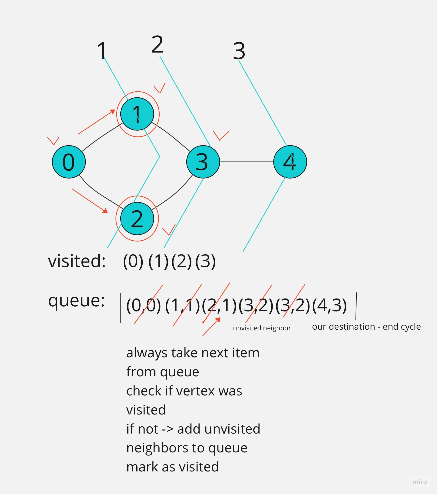

# Snakes and Ladders
## Introduction 

Implement a game - Snakes and Ladders - where we need to find 
the minimum number of turns to end the game getting from the square 1 to square 100.
On each turn players will roll a six-sided die and move forward 
a number of spaces equal to the result. If they land on a square that 
represents a snake or ladder, they will be transported ahead or behind, 
respectively, to a new square.

## How to install and run

1. If not already installed, install [miniconda](https://docs.conda.io/en/latest/miniconda.html)
2. (On Linux) If not already installed, install [poetry](https://python-poetry.org/docs/#installing-with-the-official-installer) 
by running 
```
curl -sSL https://install.python-poetry.org | python3 -
```
2. (On Windows) Open Anaconda Powershell Promt and install 
[poetry](https://python-poetry.org/docs/#installing-with-the-official-installer) if not installed

3. Add poetry to PATH if not added during intallation
4. Create new conda environment
```
conda create --name env-snakes-and-ladders
```
5. Activate new environment
```
conda activate env-snakes-and-ladders
```
6. Install python in the environment
```
conda install python=3.10
```
7. Install poetry packages
```
poetry install
```
8. Run the example problem:
```
python main.py
```
9. Run the tests:
```
pytest tests
```
10. Run linting:
```
mypy .
pylint main.py snakes_and_ladders tests
```

## Representation of the algorithm

Simple graph represents the breadth search algorithm to find a shortest path to the end:



## Materials used for this task:
1. [Breadth First Search (BFS)](https://youtu.be/xlVX7dXLS64)
2. [Snakes and Ladders detailed description](https://www.geeksforgeeks.org/snake-ladder-problem-2/)
